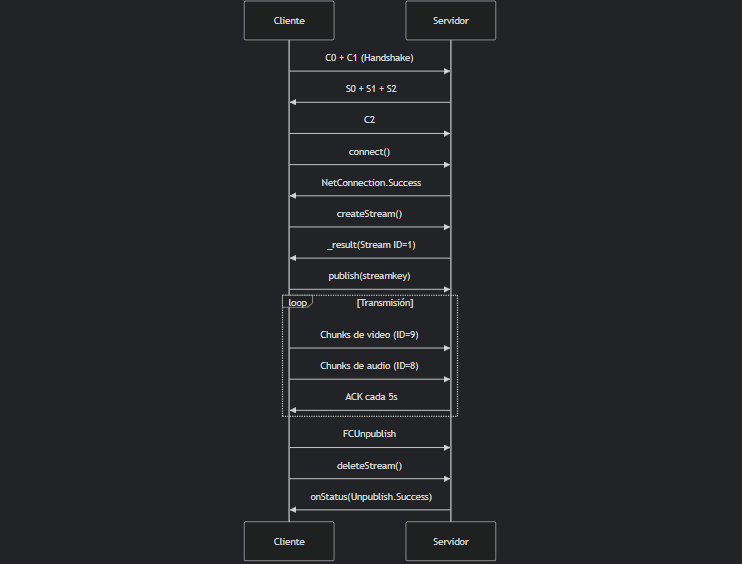

# Node RTSP/RTMP Server




## Acerca del Proyecto

Este proyecto implementa un servidor de streaming RTMP y RTSP basado en Node.js. Utiliza contenedores Docker para facilitar el despliegue del servidor y de los clientes FFmpeg para la emisión y grabación de streams.

El diagrama anterior ilustra el flujo de comunicación estándar entre un cliente y un servidor RTMP.

## Construido Con

*   [Node.js](https://nodejs.org/)
*   [CoffeeScript](https://coffeescript.org/)
*   [Docker](https://www.docker.com/)
*   [FFmpeg](https://ffmpeg.org/)
## Empezando

Sigue estos pasos para configurar y ejecutar el proyecto en tu entorno local.

### Prerrequisitos

Asegúrate de tener los siguientes entornos o herramientas instaladas y configuradas:

*   **Entornos de Trabajo Soportados:**
    *   GitHub Codespaces - Insiders
    *   Ubuntu 24.04 LTS (o similar con acceso sudo/root y Docker instalado)
    *   Otras distribuciones oficiales de Ubuntu LTS como Xubuntu
*   **Docker:** Necesario para construir y ejecutar los contenedores.
*   **Git:** Para clonar el repositorio.
*   **Make:** Para usar los comandos simplificados del `Makefile`.

### Instalación

1.  **Clona el repositorio:**
    ```bash
    git clone https://github.com/ElProConLag/node-rtsp-rtmp-server.git
    cd node-rtsp-rtmp-server
    ```

2.  **Crea la red Docker dedicada:**
    Esta red permitirá que los contenedores se comuniquen entre sí.
    ```bash
    docker network create rtmpnet
    ```

## Uso

A continuación se detallan los pasos para desplegar el servidor y los clientes.

### Desplegar el Servidor RTMP/HTTP

El servidor RTMP escuchará en el puerto `1935` y el servidor HTTP (para la página `index.html`) en el puerto `80`.

```bash
make build && make console
```
Este comando construye la imagen Docker del servidor (si aún no está construida) y luego lo inicia en modo interactivo. Los logs del servidor se mostrarán en esta consola.

### Desplegar Cliente Emisor (Cliente 1)

Este cliente utilizará FFmpeg para enviar un stream de video (ej. `bigbuckbunny`) al servidor RTMP.

1.  **Construye la imagen del cliente emisor:**
    ```bash
    docker build -f Dockerfile.cliente1 -t ffmpeg-client1 .
    ```

2.  **Ejecuta el cliente emisor:**
    ```bash
    docker run -d --name ffmpeg-client1 --add-host host.docker.internal:host-gateway --network rtmpnet ffmpeg-client1
    ```
    Esto enviará el stream a `rtmp://host.docker.internal:1935/live/bigbuckbunny`.

### Obtener direcciones IP de contenedores activos

Para conocer la IP asignada a un contenedor en la red Docker `rtmpnet`, ejecuta:

```bash
# Lista contenedores en ejecución
docker ps
# Muestra la IP de un contenedor por nombre o ID
docker inspect -f '{{range .NetworkSettings.Networks}}{{.IPAddress}}{{end}}' <nombre_o_id_contenedor>
```

### Desplegar Cliente Receptor (Cliente 2)

Este cliente utilizará FFmpeg para conectarse al stream `live/bigbuckbunny` del servidor RTMP y guardarlo en un archivo `grabacion.flv` dentro del contenedor.

1.  **Construye la imagen del cliente receptor:**
    ```bash
    docker build -f Dockerfile.cliente2 -t ffmpeg-client2 .
    ```

2.  **Ejecuta el cliente receptor:**
    ```bash
    docker run -d --name ffmpeg-client2 --add-host host.docker.internal:host-gateway --network rtmpnet ffmpeg-client2
    ```

### Captura de Red

Para analizar el tráfico RTMP (u otro tráfico de red), puedes usar `tcpdump`.

```bash
sudo timeout 30 tcpdump -i any -w tcpdump_capture.pcap
```

## Licencia

Distribuido bajo la Licencia MIT. Ver `LICENSE` para más información.
